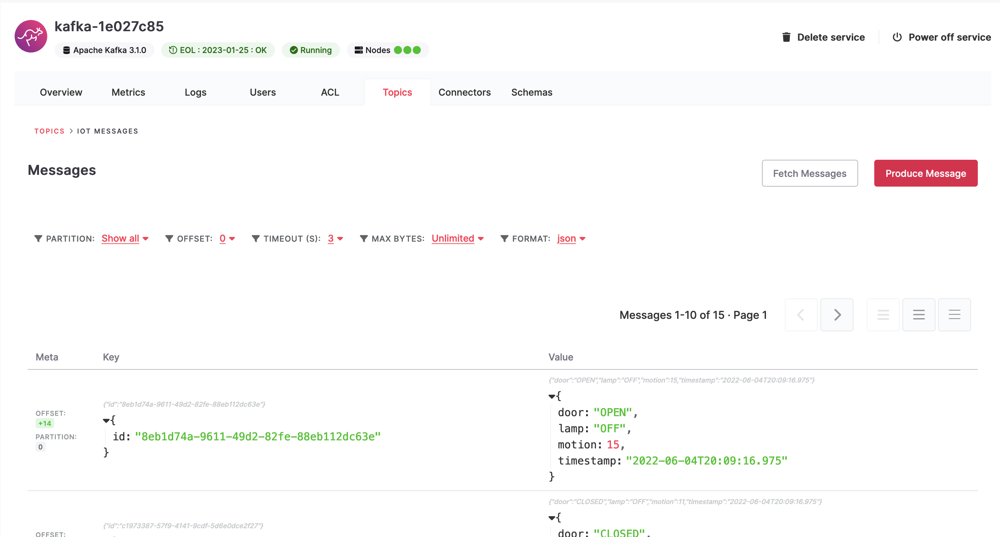
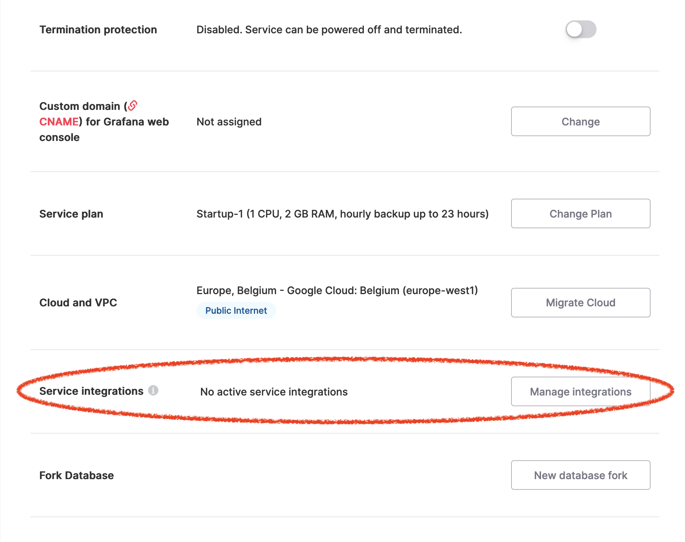
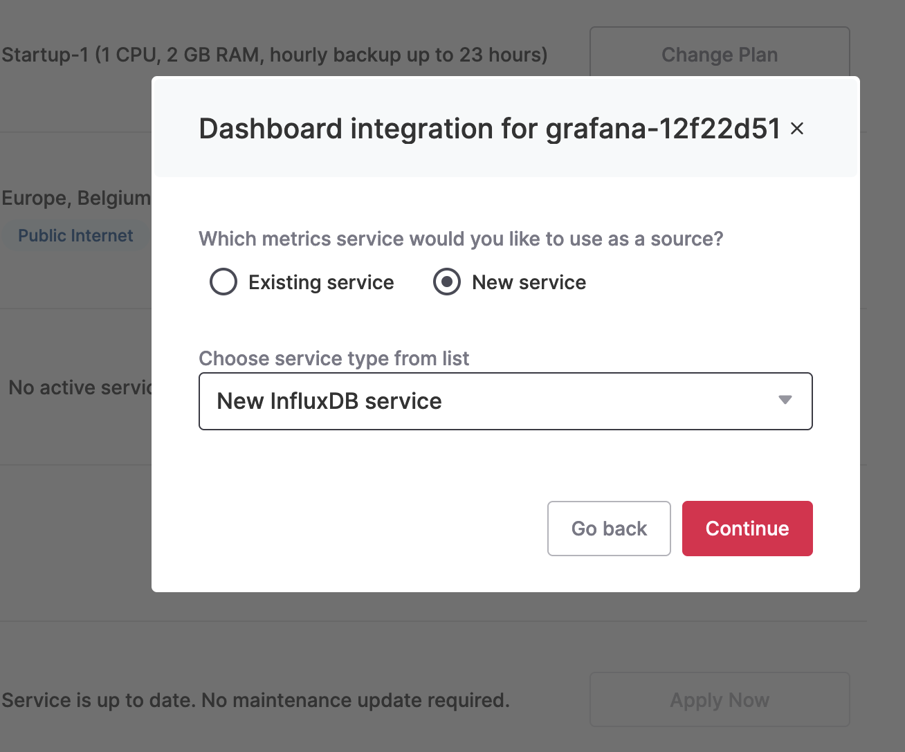
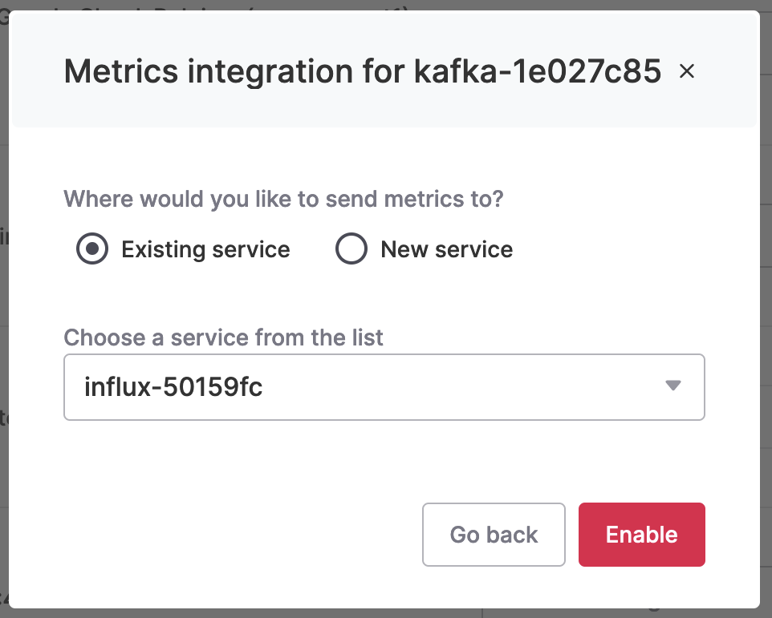
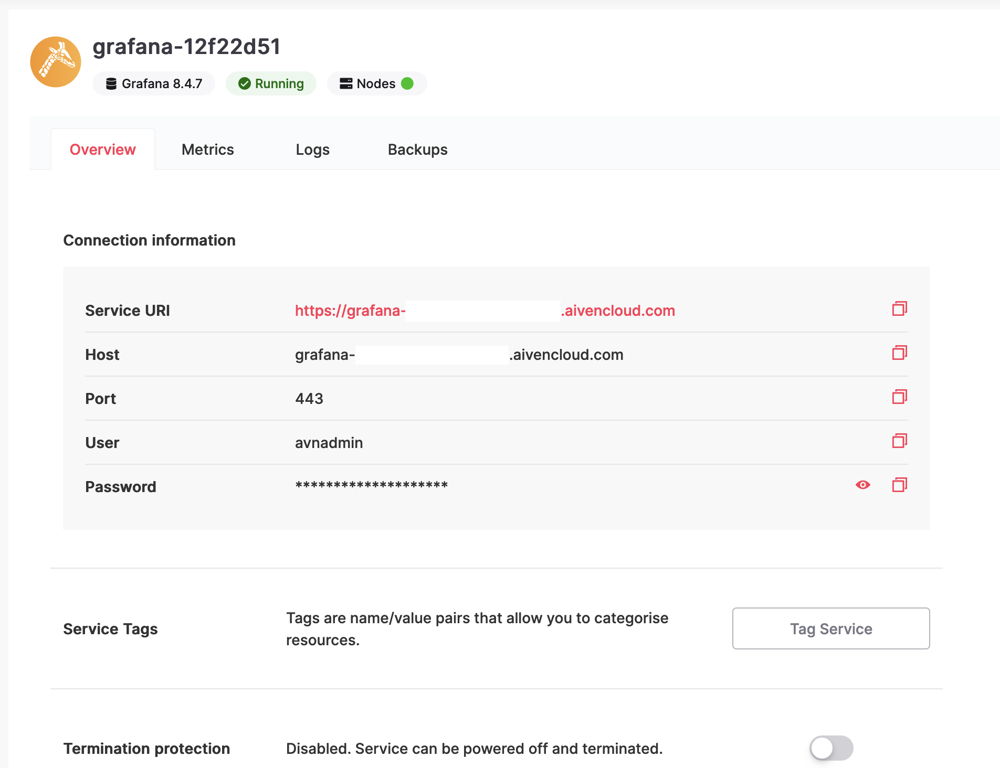
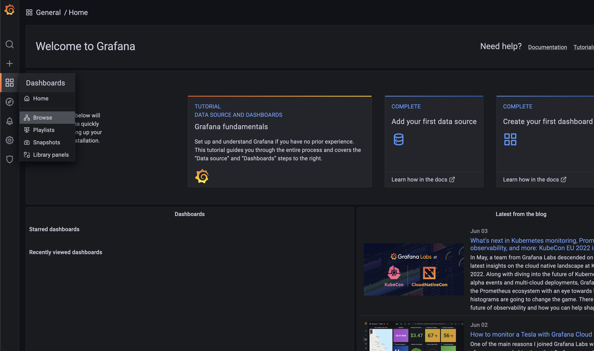
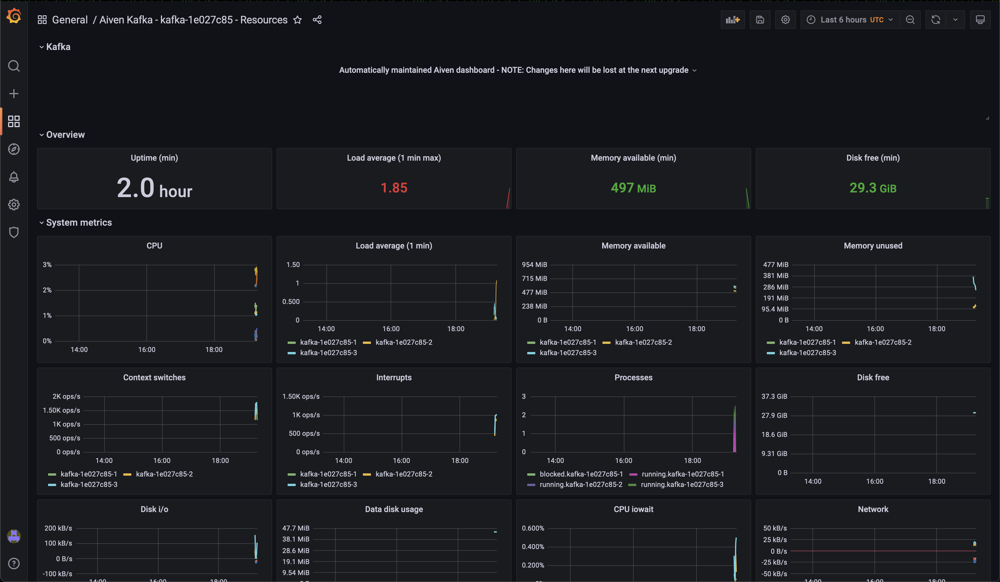

# Aiven Kafka Quickstart with Vert.x

This tutorial will enable you to create and manage a Kafka server, create a Java Kafka event producer
and then to observe and monitor your kafka service metrics in a few clicks!

We will use Aiven as a Database as a Service vendor to create and manage Kafka and other services from the Aiven web console
and also observe and monitor your Kafka service metrics by enabling some quick integrations with InfluxDB and Grafana

## Vert.x quickstart

We will use Java and the flexible toolkit [Vert.x](https://vertx.io/) for its simplicity.

Starting a project with Vert.x is easy since you can use the [App generator](https://start.vertx.io/) for that purpose.

It even has a [Kafka client](https://vertx.io/docs/vertx-kafka-client/java/) for reading and sending messages from/to an Apache Kafka cluster.

As producer, the API provides methods for sending message to a topic partition like writing on a stream.

After completing the required fields and adding the Kafka Client as dependencies to the App generator
you can Generate the Project by downloading it as a zip file or using Curl or even HTTPie.

This new project can then be run with the following command at the root
`./mvnw clean compile exec:java`
and stop it with `CTRL-C`

## Aiven Kafka setup

Before creating the Kafka producer, we need to start the Kafka service in Aiven.

Signup to your [Aiven web console](https://console.aiven.io/signup.html)

The interface is slick and straightforward and you can notice right away the $300 Credits allowed displayed on the bottom left corner of the interface.

This will be more than enough to play with Aiven Kafka.

In the Services view, create a new Aiven for Apache Kafka® service.
You can follow [this simple tutorial](https://developer.aiven.io/docs/products/kafka/getting-started.html) if need be.

You can now visit the newly created Kafka Service overview page.

Notice that the default `kafka_authentication_methods.certificate` is set to `ON`.

Enable the Apache Kafka REST API (to be able to see the messages in the console later).

Under the Topics tab, add a new topic named `IoT`.

And voila! your Kafka server is ready to receive events.

## Coding the Kafka client

Now it's time to fire your preferred Java IDE to open this project and start coding the Kafka producer.

In the MainVerticle class that was generated, we will first remove all of the createHttpServer code in the start method to start fresh.

Creating a Vert.x Kafka producer is quite similar on how it works using the native Kafka client library.

It needs to be configured with a bunch of properties as described in the official Apache Kafka documentation.

To achieve that, a map can be configured with such properties passing it to one of the static creation methods exposed by the KafkaProducer.

```java
Map<String, String> config = new HashMap<>();
config.put("bootstrap.servers", "kafka-server.aivencloud.com:99999");
config.put("key.serializer", "io.vertx.kafka.client.serialization.JsonObjectSerializer");
config.put("value.serializer", "io.vertx.kafka.client.serialization.JsonObjectSerializer");
config.put("security.protocol", "SSL");
config.put("ssl.truststore.location", "client.truststore.jks");
config.put("ssl.truststore.password", "secret");
config.put("ssl.keystore.type", "PKCS12");
config.put("ssl.keystore.location", "client.keystore.p12");
config.put("ssl.keystore.password", "secret");
config.put("ssl.key.password", "secret");

KafkaProducer<JsonObject, JsonObject> producer = KafkaProducer.create(vertx, config);
```

Hint: To properly configure your SSL authentication, follow this link
[Configure Java SSL to access Apache Kafka®](https://developer.aiven.io/docs/products/kafka/howto/keystore-truststore)

Let's now produce 5 events using the KafkaProducerRecord and stop right after that, closing properly our producer.

```java
for (int i = 0; i < 5; i++) {
  producer.write(KafkaProducerRecord.create(IOT_SENSOR_TOPIC, MockIoT.newId(), MockIoT.newPayload()));
}
producer.close();
```

Since we mock IoT sensors, you will find in the [MockIoT class](/src/main/java/net/sonyth/kafka/iot/MockIoT.java) two static methods that generates sample data.

the `newId` method generates a JSON String with an UUID number

the `newPayload` method generates a JSON Object with :
- A Timestamp
- A Smart Door that reports on its current state (OPEN, CLOSED or LOCKED)
- A Motion Sensor that returns the number of people who have passed by
- A Smart Lamp that reports on its current state (ON or OFF)

You can then run this producer with the following command :
`./mvnw clean compile exec:java`
and stop it with `CTRL-C`

## Watching the events in the Aiven console

Got to the Aiven web console under Services :

Kafka service view > Topics => Topic => Fetch Messages (Format: json)

You should be able to see your Json formatted messages



## Metrics and Integrations

Now, we'll gather metrics from our Kafka server by enabling InfluxDB and Grafana integrations

To start a Grafana server, follow [this simple tutorial](https://developer.aiven.io/docs/products/grafana/get-started.html)

You can now visit the newly created Grafana Service overview page.

And click on the `Manage Integrations` button under `Service Integrations` at the bottom of the page.



Pick and configure the Grafana Dashboard integrations with a new InfluxDB service



This will automatically create a new Aiven InfluxDB service for you and link it to your Grafana service.

Now for the connection between Kafka and InfluxDB, visit the Kafka Service overview page.

Click on the `Manage Integrations` button under `Service Integrations` at the bottom of the page.

Pick and configure the Metrics integrations with your newly created InfluxDB existing service



Well done! You swiftly integrated Kafka - InfluxDB - Grafana in a few simple clicks!

Let's now connect to the Grafana Dashboard webpage by first looking up the host/user/pass on the Grafana Service overview page.



Fire up your favorite browser and go to the Grafana service URI

Click on the Dashboards icon on the left and on the `Browse` link to select our Aiven Kafka Dashboard



Congratulations, you can now enjoy the already configured Aiven Grafana Dashboard of your Aiven Kafka service resources




